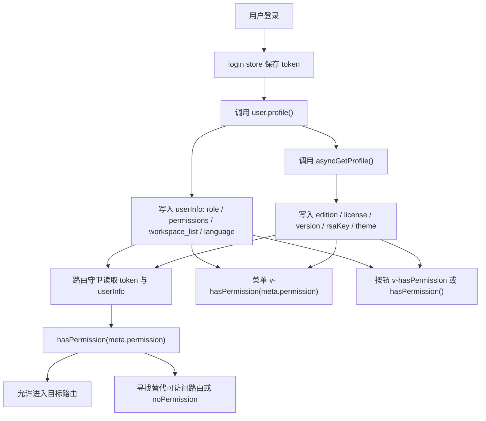

# 第 3 阶段：理解用户上下文与权限系统

本阶段要回答一个核心问题：用户登录之后，前端到底知道了什么？这些信息又如何决定“能进入哪些路由、能看到哪些菜单、能点击哪些按钮”。

如果你只看登录表单，很容易误以为登录就是拿 token。实际上，在这个项目里，token 只是入场券；真正支撑业务判断的是登录后补齐的用户上下文。

## 一、登录后系统获得了哪些上下文

登录入口在 `src/stores/modules/login.ts`。这个 store 做的事情很克制：

1. 调用登录接口。
2. 保存 `token` 到 Pinia 状态和 `localStorage`。
3. 立刻调用 `user.profile()` 拉取用户上下文。

也就是说，`login` store 不负责解释用户是谁、有多少权限、属于哪个工作空间。它只负责完成认证，并把后续上下文加载交给 `user` store。

这是一种很重要的工程分层：认证上下文和业务上下文分开。认证回答“你是否登录”，用户上下文回答“你是谁，你在系统里能做什么”。

### 1. token 上下文

`login.getToken()` 的优先级是：

1. 先读 Pinia 内存态 `this.token`。
2. 如果内存没有，再读 `localStorage.getItem('token')`。

这样做的原因是刷新页面后 Pinia 状态会丢失，但 `localStorage` 可以让会话延续。请求拦截器和路由守卫都可以通过这个方法判断用户是否已登录。

登录成功后，多个登录方式都会走相同的模式：

```ts
this.token = ok?.data?.token;
localStorage.setItem("token", ok?.data?.token);
const user = useUserStore();
return user.profile(loading);
```

这里的关键不是“写 token”，而是“写完 token 后必须拉用户上下文”。如果缺少 `user.profile()`，后续权限判断会因为 `userInfo` 为空而全部失败。

### 2. 用户基础上下文

`src/stores/modules/user.ts` 的 `profile()` 会调用 `UserApi.getUserProfile()`，并写入：

- `userInfo`：用户基础信息，包含角色 `role`、权限 `permissions`、语言 `language`、工作空间列表 `workspace_list` 等。
- `workspace_list`：当前用户可见的工作空间列表。
- `workspace_id`：当前选中的工作空间。
- 语言偏好：写入 `localeConfigKey` 对应的本地存储。
- 主题：根据用户和平台配置切换主题。

这里要特别注意 `workspace_id`。权限并不是全局平铺的，很多权限会拼接当前工作空间：

```ts
APPLICATION: READ: /WORKSPACE/adefltu;
WORKSPACE_MANAGE: /WORKSPACE/adefltu;
```

所以当前工作空间不是普通 UI 状态，它是权限判断的输入之一。

### 3. 平台与授权上下文

`profile()` 的最后会调用 `asyncGetProfile()`，它再请求一次 `UserApi.getProfile()`，写入：

- `license_is_valid`：授权是否有效。
- `edition`：当前版本，取值为 `CE（社区版）、PE（专业版）、EE（企业版）`。
- `version`：系统版本。
- `rsaKey`：加密相关公钥。
- 主题配置：企业版/专业版且授权有效时请求远端主题，否则使用默认平台主题。

为什么版本和 license 要进入用户 store？因为它们会参与权限表达式。项目并不是只判断用户角色，还会判断“当前版本是否允许该能力”。例如 `EditionConst.IS_EE`、`EditionConst.IS_PE` 会被当成权限条件的一部分。

### 4. 聊天用户上下文

`src/stores/modules/chat-user.ts` 是另一套上下文，服务于公开聊天或应用访问场景。它和后台管理登录不同：

- 使用 `accessToken` 标识某个应用访问入口。
- 通过 `chat_profile` 判断应用是否需要认证。
- 通过 `application` 保存应用配置，例如语言。
- 聊天访问 token 存在 `sessionStorage` 和 `localStorage`，key 会带上 `${accessToken}-accessToken`。

这套设计说明系统里至少有两类“用户”：

- 管理端用户：走 `login` + `user` store，拥有角色、权限、工作空间、版本上下文。
- 聊天端用户：走 `chat-user` store，围绕应用访问和聊天认证建立上下文。

把这两套 store 分开，是为了避免公开聊天场景被管理端权限模型污染。

## 二、权限模型如何表达

权限核心在两个文件：

- `src/utils/permission/type.ts`：定义权限表达式对象。
- `src/utils/permission/index.ts`：执行权限判断。

### 1. Role

`Role` 表示角色，例如 `ADMIN`、`USER`、`WORKSPACE_MANAGE`。

它有两个重要方法：

- `getWorkspaceRole()`：生成当前工作空间下的角色对象。
- `getWorkspaceRoleString()`：生成当前工作空间下的角色字符串。

设计原因是同一个角色在不同工作空间含义不同。`WORKSPACE_MANAGE:/WORKSPACE/A` 不能天然等价于 `WORKSPACE_MANAGE:/WORKSPACE/B`。

### 2. Permission

`Permission` 表示能力点，例如 `APPLICATION:READ`、`USER_MANAGEMENT:READ+EDIT`。

它提供几类派生方法：

- `getWorkspacePermission()`：当前工作空间级权限。
- `getWorkspacePermissionWorkspaceManageRole()`：工作空间管理员角色下的权限。
- `getWorkspaceResourcePermission(resource, resource_id)`：某个资源实例级权限。
- `getKnowledgeWorkspaceResourcePermission()` / `getApplicationWorkspaceResourcePermission()` 等：领域语义更明确的资源权限。

这是一种从“粗权限”到“细权限”的建模方式：

- 系统级：能不能管理某类系统资源。
- 工作空间级：能不能在当前工作空间做某事。
- 资源级：能不能操作某个具体知识库、应用、模型、工具。

### 3. Edition

`Edition` 表示版本条件。`user.getEdition()` 会根据 `edition` 和 `license_is_valid` 转成：

- `X-PACK-CE`
- `X-PACK-PE`
- `X-PACK-EE`

注意：`PE` 和 `EE` 必须 license 有效才会命中，否则会退回不满足专业版/企业版能力的状态。这就是为什么权限系统需要同时看 `edition` 和 `license_is_valid`。

### 4. ComplexPermission

`ComplexPermission` 用来表达复杂条件：

```ts
new ComplexPermission(roleList, permissionList, editionList, compare);
```

它可以同时判断：

- 是否命中某些角色。
- 是否命中某些权限。
- 是否命中某些版本。
- 角色和权限之间用 `AND` 或 `OR` 合并。

工程上，这是为了避免在页面里堆很多业务 if。权限规则被抽象成一个可传递的对象后，可以放到路由 `meta.permission`、按钮指令、业务函数里统一解释。

## 三、hasPermission 的判断链路

`hasPermission()` 是统一入口。它支持单个权限，也支持权限数组。

数组时：

- `OR`：任意一个条件满足即可。
- `AND`：所有条件都必须满足。

单项权限由 `hasPermissionChild()` 解释：

1. 空权限：直接放行。
2. 函数权限：先执行函数，再判断返回值。
3. `Role`：判断 `user.getRole()` 是否包含该角色。
4. `Permission`：判断 `user.getPermissions()` 是否包含该权限。
5. `Edition`：判断 `user.getEdition()` 是否等于该版本。
6. `ComplexPermission`：分别判断角色、权限、版本，再按 `compare` 合并。
7. 字符串：直接在 permissions 中匹配。

这里有一个很关键的设计：权限项可以是函数。路由详情页经常需要根据当前 route params 生成资源级权限，例如应用详情页要拿 `to.params.id` 拼出某个应用实例的权限。静态常量无法表达这个信息，所以系统允许权限表达式延迟求值。

## 四、权限如何影响路由

路由权限主要由 `src/router/index.ts` 和 `src/router/common.ts` 驱动。

### 1. 进入路由前补齐上下文

全局 `beforeEach` 做了几件事：

1. 404 直接放行。
2. 白名单路由不要求登录，例如登录页、找回密码、聊天页。
3. 非白名单路由先读 token，没有 token 就跳 `/login`。
4. 有 token 但没有 `user.userInfo`，调用 `user.profile()` 补齐上下文。
5. 调用 `set_next_route(to)` 保存当前目标路由。
6. 判断 `to.meta.permission`。

为什么要在权限判断前调用 `user.profile()`？因为权限判断依赖 `userInfo.permissions`、`userInfo.role`、`edition`、`workspace_id`。没有这些上下文，`hasPermission()` 没有判断依据。

### 2. meta.permission 决定能否进入

如果目标路由配置了 `meta.permission`，守卫会调用：

```ts
hasPermission(to.meta.permission as any, "OR");
```

通过则 `next()`；不通过则调用 `getPermissionRoute(routes, to)` 找一个用户有权限访问的替代路由。

这不是简单跳 403，而是优先找同级或全局可访问路由。原因是后台系统通常有多个相邻 tab 或模块：用户没权限访问当前 tab 时，让他进入同组下一个可访问页面，比直接打断体验更友好。

如果最终找不到任何可访问路由，才跳到 `noPermission`。

### 3. get_next_route 的作用

一些路由模块的权限是函数，需要读取当前目标路由的 params。`router.beforeEach` 会先 `set_next_route(to)`，这些函数再通过 `get_next_route()` 读取目标路由。

这是一种“延迟计算权限”的方式。它解决的是动态资源权限问题：权限字符串里需要资源 id，但资源 id 只有在进入具体路由时才知道。

### 4. 菜单展示也复用 meta.permission

侧边栏组件会对菜单项使用：

```vue
v-hasPermission="menu.meta?.permission"
```

子菜单也一样：

```vue
v-hasPermission="child.meta?.permission"
```

所以 `meta.permission` 同时服务两件事：

- 路由守卫：是否允许进入页面。
- 菜单渲染：是否显示该菜单入口。

这是前端权限系统常见的“双层使用”：路由守卫保证不能通过 URL 直接进入，菜单隐藏减少无效入口。

## 五、权限如何影响按钮

按钮权限主要通过两种方式实现。

### 1. v-hasPermission 指令

`src/directives/hasPermission.ts` 注册了全局指令。它读取绑定值：

```ts
binding.value?.permission || binding.value;
binding.value?.compare || "OR";
```

然后调用 `hasPermission()`。如果没有权限：

```ts
el.style.display = "none";
```

如果有权限，则删除 `display` 样式。

注意这里更像 `v-show`，不是 `v-if`。元素已经创建，只是被隐藏。项目里的 `src/views/Permission.vue` 也提醒了这一点。

工程含义是：按钮隐藏只是体验层控制，不是安全边界。真正的安全边界必须在后端接口鉴权。前端权限的价值是减少误操作、让界面匹配用户能力。

### 2. 直接调用 hasPermission()

很多页面会直接在 `v-if`、computed、函数判断里调用 `hasPermission()`。这种方式适合更复杂的 UI 逻辑，例如：

- 某个 tab 是否出现。
- 某个操作列按钮是否展示。
- 根据权限决定默认进入哪个子页面。
- 动态表单或授权弹窗中决定可选项。

指令适合“这个元素有没有权限就显示/隐藏”；函数适合“权限判断结果还要参与业务分支”。

## 六、从登录到按钮的完整链路

可以把整个过程理解成下面这条链：



这条链路里，`user` store 是核心枢纽。登录、路由、菜单、按钮本身并不直接知道权限来源，它们只依赖统一的 `hasPermission()`。

## 七、源码阅读路线

建议按下面顺序读，而不是按文件名读：

1. `src/stores/modules/login.ts`

    先看登录成功后为什么必须调用 `user.profile()`。这里建立“认证完成后加载上下文”的意识。

2. `src/stores/modules/user.ts`

    重点看 `profile()` 和 `asyncGetProfile()`。把 `userInfo`、`workspace_id`、`workspace_list`、`edition`、`license_is_valid` 这些字段串起来。

3. `src/utils/permission/type.ts`

    看 `Role`、`Permission`、`Edition`、`ComplexPermission` 如何把权限规则对象化。尤其关注工作空间和资源级权限是如何拼字符串的。

4. `src/utils/permission/index.ts`

    看 `hasPermissionChild()` 的类型分发。这个函数是权限系统的解释器。

5. `src/router/index.ts`

    看路由守卫如何先确保 token 和 user profile，再判断 `meta.permission`。

6. `src/router/common.ts`

    看 `getPermissionRoute()` 如何在无权限时寻找替代路由。

7. `src/directives/hasPermission.ts`

    看按钮和菜单如何复用同一套权限判断。

8. `src/stores/modules/chat-user.ts`

    最后看聊天端上下文。它不是后台管理权限链路的一部分，但能帮助你理解项目为什么拆成“管理端用户”和“聊天端用户”两套 store。

## 八、工程思想总结

这个项目的权限系统有三个值得学习的点。

第一，权限判断依赖上下文，而不是只依赖 token。token 只证明身份，`role`、`permissions`、`workspace_id`、`edition`、`license_is_valid` 才决定用户能力。

第二，权限规则被对象化。`Role`、`Permission`、`Edition`、`ComplexPermission` 让路由、菜单、按钮可以使用同一种表达式，避免每个页面重复写散乱的 if。

第三，权限表达式支持动态求值。资源级权限必须依赖 route params 或当前 workspace，因此函数型权限是必要的。它让“权限规则定义在路由上”和“权限值运行时才知道”这两个目标同时成立。

你可以把它理解成一个小型解释器：业务模块声明权限表达式，`hasPermission()` 在当前用户上下文里解释它，最终得到 true 或 false。

## 九、性能与风险点

权限判断本身是同步数组匹配，成本通常不高。但有两个潜在问题值得注意。

第一，`permissions.includes()` 和 `role.includes()` 是线性查找。如果用户权限列表非常大，页面上又大量调用 `hasPermission()`，可能出现重复计算成本。更高阶的优化方式是把 permissions 和 role 派生成 `Set`，但这需要评估现有响应式和调用方式。

第二，`v-hasPermission` 在 `created` 和 `beforeUpdate` 都会执行。对于大列表中的大量按钮，如果每次更新都触发权限判断，会产生额外开销。通常这还不是瓶颈，但在权限复杂、列表密集的页面上要有意识。

第三，`v-hasPermission` 只是隐藏元素。它不等于安全控制。任何重要接口都必须由后端再次鉴权，否则用户仍可能绕过 UI 发请求。

## 十、一句话心智模型

登录后，系统先拿 token，再用 token 换取完整用户上下文；路由、菜单、按钮都不直接判断业务身份，而是把权限表达式交给 `hasPermission()`，由它结合当前用户的角色、权限、版本和工作空间上下文做统一解释。
